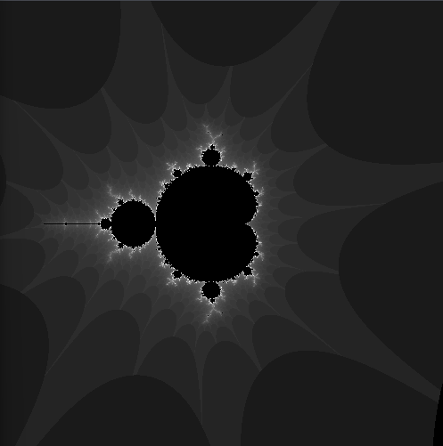

# Mandelbrot Set Visualization with p5.js

This repository contains a simple implementation of the Mandelbrot Set visualization using p5.js, a JavaScript library for creative coding.

## Overview

The Mandelbrot Set is a famous mathematical fractal that exhibits intricate and self-replicating patterns. This project uses p5.js to create an interactive and visually appealing representation of the Mandelbrot Set.

## MandelBrot Set DEMO



## Getting Started

1. Clone the repository:

    ```bash
    git clone https://github.com/belarminojunior/Mandelbrot-Set
    ```

2. Open the `index.html` file in your preferred web browser.

3. Explore the Mandelbrot Set by clicking and dragging to zoom in on different regions.

## Customization

Feel free to customize the code to experiment with different color schemes, rendering techniques, or interactive features. The main logic for the Mandelbrot Set is implemented in the `mandelbrot.js` file.

## Dependencies

- [p5.js](https://p5js.org/) - JavaScript library for creative coding.

## Acknowledgments

- [Benoît B. Mandelbrot](https://en.wikipedia.org/wiki/Beno%C3%AEt_Mandelbrot) - For introducing the Mandelbrot Set to the world.

## License

This project is licensed under the MIT License - see the [LICENSE](LICENSE) file for details.